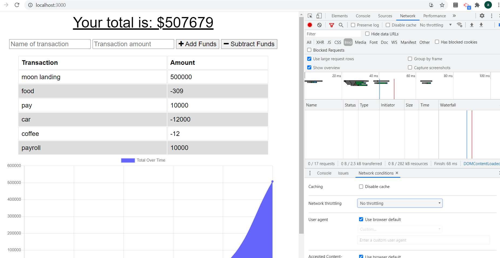
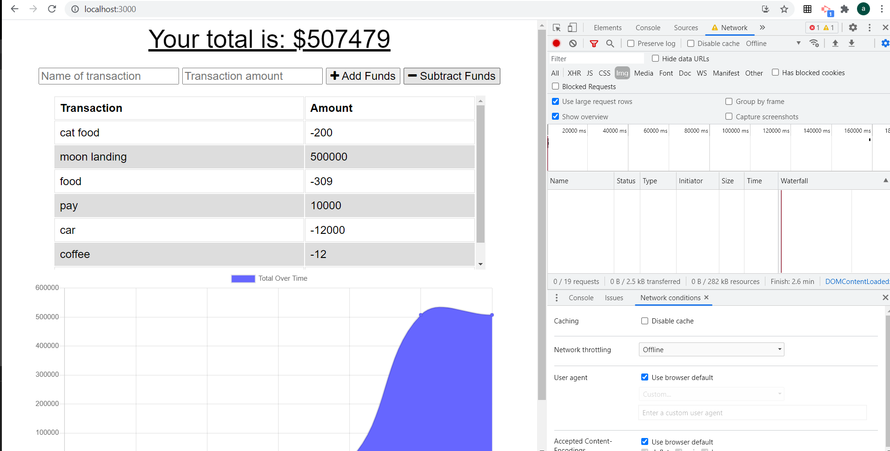
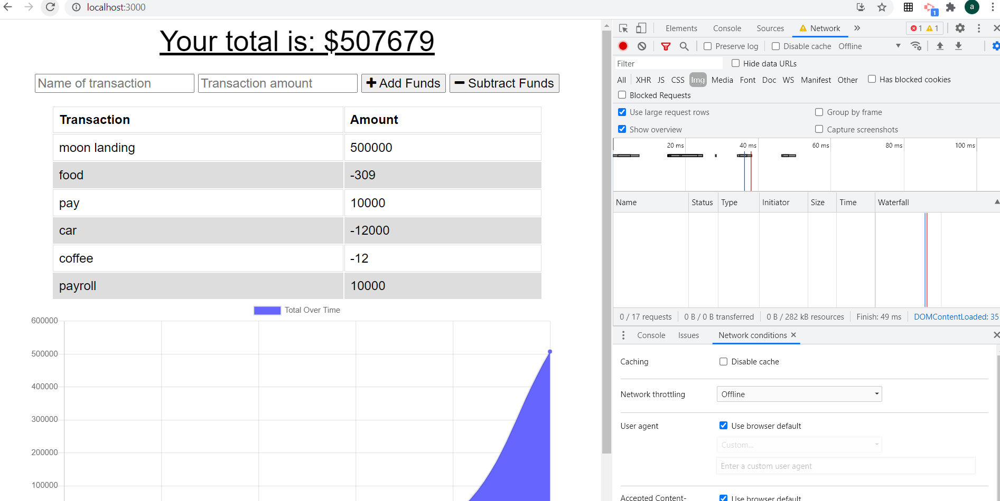
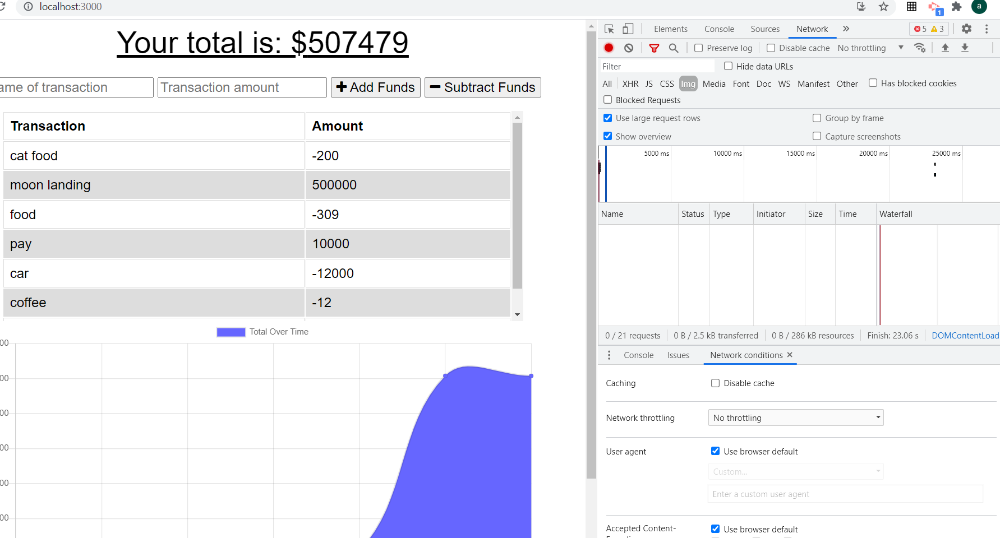

# Progressive Budget

  
[](https://opensource.org/licenses/mit)
  
## Description
to be able to budget on and offline
  
## Table of Contents
- [Installation](#installation)
- [Usage](#usage)
- [Screenshots](#screenshots)
- [Links](#links)
- [License](#license)
- [Questions](#questions)
  
## Installation
```md
perform npm i
```
  
## Usage
```md
doesn't matter if you are on or offline you can update your budget
```
  
## Screenshots
this is before adding anything

adding an item while offline

refreash while offline 

notice that when back online item reappears

## Links

  
## Reporting
```md
Github
```
## License
[](https://opensource.org/licenses/mit)
  
## Questions a
Add an issue through GitHub:
 https://github.com/Ashiemotto
  
Or using email:
Email: ashheadley@gmail.com

